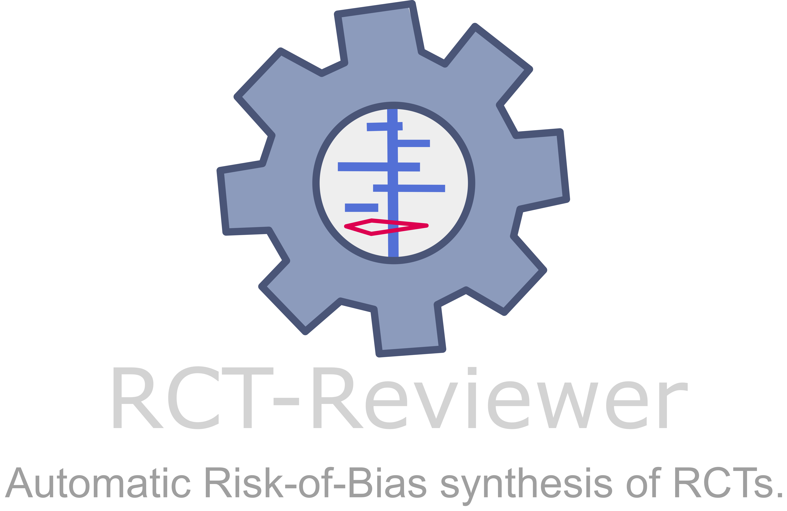

[](https://github.com/RCT-Reviewer/RCT-Reviewer-Online/actions/workflows/ci.yml)

---

**Frontend. Please check out:**

* **Main Website**: Official website for RCT-Reviewer with documentation, features, and project information.
  * 🔗 https://rct-reviewer.github.io

* **Main Repository**: The complete source code, local installation, development files, and model integration for RCT-Reviewer.
  * 🔗 https://github.com/aurumz-rgb/RCT-Reviewer

* **RCT-Reviewer Online Repository**: Source code for the hosted Streamlit web application.
  * 🔗 https://github.com/RCT-Reviewer/RCT-Reviewer-Online

* **Original Project (RobotReviewer)**: RCT-Reviewer is a modernized, standalone reimplementation inspired by the original RobotReviewer project.
  * 🔗 https://github.com/ijmarshall/robotreviewer

* **Default Model Weights (Hugging Face)**: Repository containing the default `.joblib` machine learning models used by RCT-Reviewer.
  * 🔗 https://huggingface.co/Aurumz/RCT-Reviewer

* **Alternative Model Weights (Hugging Face)**: Repository containing legacy `.pickle` and `.pck` model files for compatibility.
  * 🔗 https://huggingface.co/Aurumz/RCT-Reviewer-pickle

* **RCT-Reviewer Online**: Use the hosted web version of RCT-Reviewer without installing anything locally.
  * 🔗 https://rct-reviewer.streamlit.app

---


##  Citation

If you use the online tool or the underlying software in your research, please cite both the updated RCT-Reviewer version and the original RobotReviewer paper.

### RCT-Reviewer (This Version)

Sahu, V. (2026). RCT-Reviewer: A Modernized, Standalone Tool for Automated Analysis of Clinical Trials (RCTs). Zenodo. https://doi.org/10.5281/zenodo.20618338

```bibtex
@software{RCT-Reviewer,
  author    = {Sahu, V.},
  title     = {RCT-Reviewer: A Modernized, Standalone Tool for Automated Analysis of Clinical Trials (RCTs)},
  year      = {2026},
  publisher = {Zenodo},
  doi       = {10.5281/zenodo.20618338},
  url       = {https://doi.org/10.5281/zenodo.20618338}
}
```

### Original RobotReviewer

Marshall IJ, Kuiper J, Banner E, Wallace BC. “Automating Biomedical Evidence Synthesis: RobotReviewer.” Proceedings of the Conference of the Association for Computational Linguistics (ACL). 2017 (July): 7–12.

```bibtex
@article{RobotReviewer2017,
  title    = "Automating Biomedical Evidence Synthesis: {RobotReviewer}",
  author   = "Marshall, Iain J and Kuiper, Jo{\"e}l and Banner, Edward and Wallace, Byron C",
  journal  = "Proceedings of the Conference of the Association for Computational Linguistics (ACL)",
  volume   = 2017,
  pages    = "7--12",
  month    = jul,
  year     = 2017,
}
```

---

## License

[](https://www.gnu.org/licenses/gpl-3.0.en.html)

This project is a derivative work of [RobotReviewer](https://github.com/ijmarshall/robotreviewer) and is distributed under the GNU GENERAL PUBLIC LICENSE v3.0.