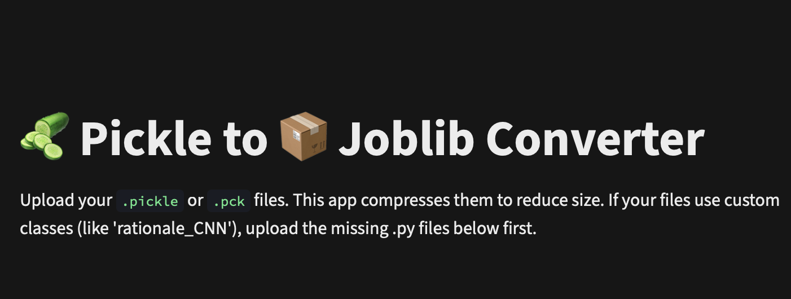

As the name suggests, this tool converts `.pickle` / `.pkl` / `.pck` machine learning model files into compressed `.joblib` files.

It is especially useful for reducing model size, improving loading efficiency, and preparing ML models for deployment.

---

Just a frontend for: [RCT-Reviewer/pickle-to-joblib](https://github.com/RCT-Reviewer/pickle-to-joblib).
So, check that out for more Information.